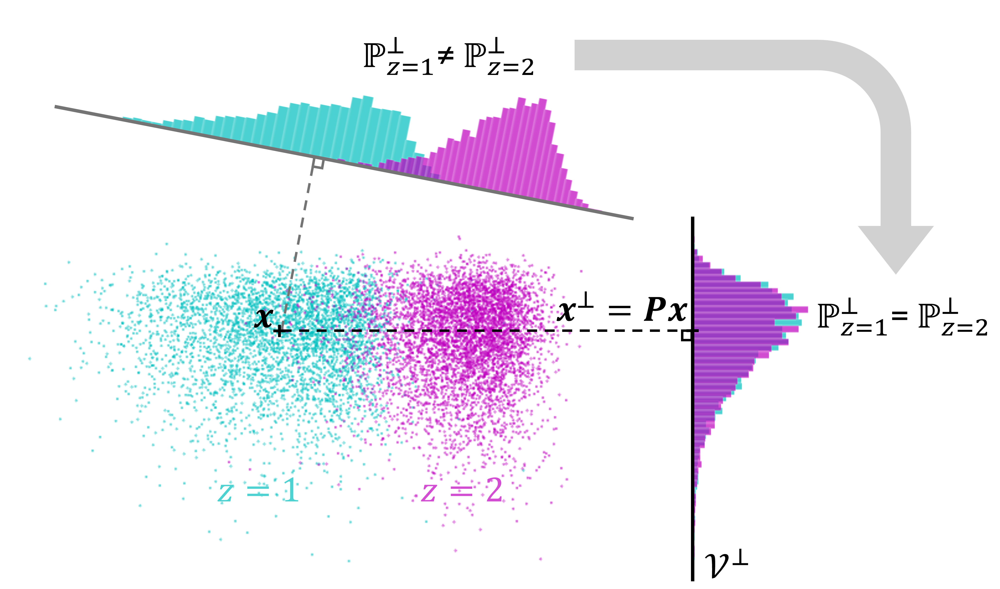

# Nonlinear Concept Erasure: a Density Matching Approach

This repository contains the code and data for the experiments included in the paper:

**Saillenfest, A. & Lemberger, P. (2025). Nonlinear Concept Erasure: A Density Matching Approach.** (to appear in Proceedings of ECAI 2025- 28th European Conference on Artificial Intelligence).<br/>
The full version of the paper (article + supplementary material) can be found here: https://arxiv.org/abs/2507.12341




$\overline{\mathrm{L}}\mathrm{EOPARD}$ erases a discrete attribute $z$ by learning an orthogonal projection $P$ onto a subspace $\mathcal{V}^\perp$ of the feature space in which the distributions of the projected samples $x^\perp = Px$ are indistinguishable across values of the protected attribute to erase $z$.


## Run the experiments

To run the experiments:
- Download Bias in Bios
- Download the top 150k GloVe embeddings (solely used to calculate WS-353)
- Download DIAL
- Run the experiments


## Downloads

To download Bias in Bios and compute the embeddings of the representations, follow the instructions in "datasets/biasbios/readme.md"

Download the top 150k GloVe embeddings from the RLACE (Ravfogel et al., 2022) repository : https://nlp.biu.ac.il/~ravfogs/rlace/glove/glove-top-50k.pickle 
Put the file in "datasets/GloVe" under the name: "glove-top-150k.pickle".

To download DIAL (Deepmoji), follow the instructions from the KRaM repository: https://github.com/brcsomnath/KRaM/blob/master/data/README.md 

## Run the experiments

To run the experiments:

> python main.py 

Output projections will be stored in "./outputs".
The program runs the evaluation after each training.
Some configurations are already defined in main.py, a base config is used to define default parameters in configs/base_config.yml

To generate the t-SNE vizualisation of the embeddings, run "xxx_display.ipynb" after selecting the appropriate projection to evaluate (xxx is GloVe, biasbios, or dial)

## Setup environment


Python version: 3.12.9

Setup an environment (we used [uv](https://docs.astral.sh/uv/getting-started/))

\# Create the environment

```shell
uv venv leopard
```

\# Install the libraries
```shell
uv pip install torch torchvision torchaudio --index-url https://download.pytorch.org/whl/cu126
uv pip install scikit-learn concept_erasure pyyaml transformers tqdm ipykernel matplotlib
```

\# Activate the environment
```shell
source leopard/bin/activate
```

See also the ```requirement.txt``` file.